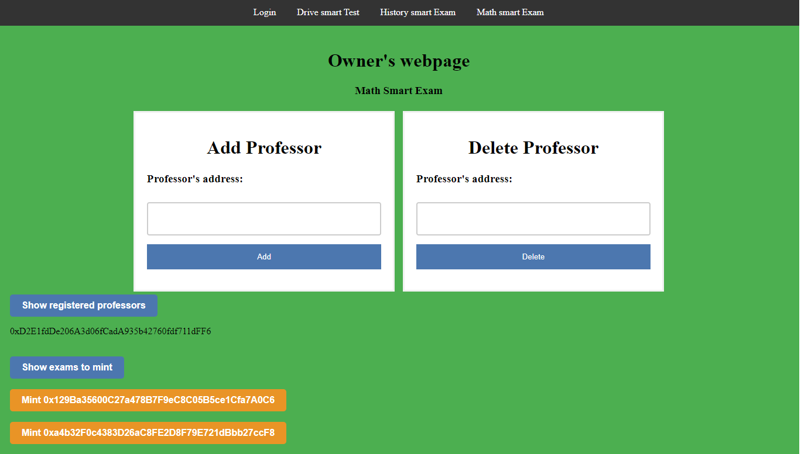
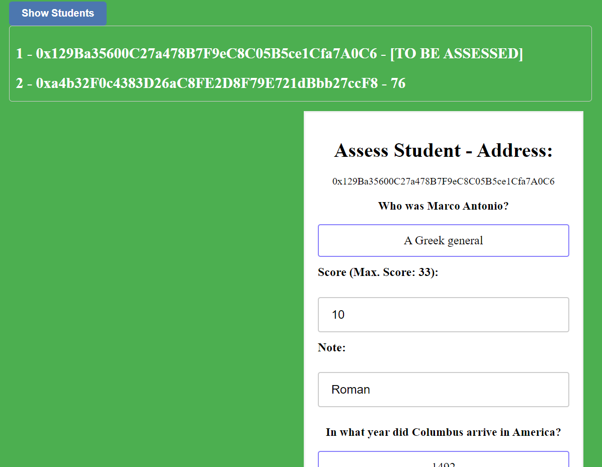

Smart Exam Dapp
=============================

###
- [Overview](#overview-mag) :mag:
- [Context of the project](#context-of-the-project-pencil) :pencil:
- [Use cases](#use-cases-page_facing_up) :page_facing_up:
    - [History exam](#history-exam-page_with_curl) :page_with_curl:
    - [Math exam](#math-exam-1234) :1234:
    - [Drive test](#drive-test-car) :car:
- [Setup and requirements](#setup-and-requirements-gear) :gear:
- [Features and interface](#features-and-interface-bookmark_tabs) :bookmark_tabs:
    - [Owner](#owner-crown) :crown:
    - [Professor](#professor-🧑‍🏫) 🧑‍🏫
    - [Student](#student-🧑‍🎓) 🧑‍🎓
- [Upload files to IPFS](#upload-files-to-ipfs-arrow_up) :arrow_up:
- [Useful links](#useful-links-link) :link:

###

## Overview :mag:   

The goal of this project was to learn how to develop a simple Dapp by implementing some smart contracts with *[Solidity](https://docs.soliditylang.org/en/v0.8.19/)*. The smart contracts are developed in a local blockchain that emulates the *[Ethereum](https://ethereum.org/en/)* blockchain and the web interface was made with *html* and *javascript*.

## Context of the project :pencil:

In countries such as Spain and Italy, at the end of high school, students are required to take a series of examinations that assess the competences acquired by them during their studies. In the case of Spain, all students in the same autonomous community (region) have to take these exams, with the same questions, on the same day at the same hour. In addition, the marks obtained in these exams play a fundamental role for the admission in a bachelor degree programme, because universities assign places according to the ranking of grades.

Problems often arise, such as a late start in one place or a leaked exam in one city, which means that the reserve exam has to be used. There are also situations in which the student is not satisfied with his or her mark, in that case the student can ask for a second assessment, but the correction of the exam is never shown.

## Use cases :page_facing_up:

The aim of the *Smart Exam Dapp* is to solve the above problems. If each exam is a smart contract, it is possible to manage the visibility of the exam with theprofessor's notification. Moreover, at the same time, once the exam is corrected, the student will have theprofessor's notes and the exam mark available.

### History exam :page_with_curl:
One of the most common types of exams, for example history exams, is the one in which the student has to answer questions by writing a text, the length of which may vary depending on the question. By taking the exam in the application, the student will be able to see his or her answers and even theprofessor's comments in addition to his or her mark.

### Math exam :1234:
In exams such as mathematics or physics we have a big problem, these cannot be done by computer because it would require knowledge of languages such as *latex* and it would take a lot of time to write them. Therefore, instead of using a normal smart contract, the student must upload his contract to an IPFS. With the link of his metadata a NFT will be created letting theprofessor now the owner of it.

### Drive test :car:
Another type of exams in which this project can be used is the theory test for the driving licence. Multiple choice questions can be added, and once the student completes the test, the grade will be available without anyprofessor interaction.

## Features and interface :bookmark_tabs:
On the main tab there is a login where each user of the blockchain can be identified by using their private key on the blockchain. This login allows to know if the user exists, to identify him and to redirect him to his corresponding page: owner,professor or student. For the identification it is used the user's address and the SHA256 hash of his private key, which are stored in a local file.


### Owner :crown:

The owner is the one who has migrated the contract to the blockchain (the first account in *Ganache*), it can be for example the government of the region.  The owner is in charge of adding and deleting professors (identified by their address on the blockchain) to each subject exam and also minting the NFTs in the case of mathematics exams.



### Professor 🧑‍🏫

The professor is in charge of adding and deleting questions in each exam, indicating that the exam is finished (once finished, the exam cannot be modified) and marking the exams in the case of history and mathematics exams.




### Student 🧑‍🎓

The student can simply answer the drive test, the questions in the history exam or add the link to the image's metadata in the math exam (check the section [Upload files to IPFS](upload-files-to-ipfs-arrow_up)). When the exams are assessed, the student will also be able to see his/her answers, the professor's notes and his/her score. 


## Setup and requirements :gear:

Firstly, we have to clone this *github* repository. Then we need a blockchain to deploy our smart contracts, *tesnets* such as *[Goerli](https://goerli.net/)* are very popular to deploy the smart contract in the same way as in a real blockchain like *Ethereum* but using free test coins. In our case it was used the *[Ganache](https://trufflesuite.com/ganache/)* desktop application that locally emulates a blockchain with 10 users/nodes and makes it possible to check all transactions and the balance of contracts in a simple way.


To deploy the smart contract in *Ganache* it has been added the `truffle-config.js` that connects the smart contracts to the local blockchain. Then, we can use the command `truffle migrate` to deploy the contracts in *Ganache*. If we don't have `truffle` we can install it using the `node`command `npm install truffle`.

Now, we have to change the file `src/user.json` with the address of *Ganache's* accounts and the hash SHA256 of the private keys. We can compute here the [SHA256](https://emn178.github.io/online-tools/sha256.html).

Before initializing the app server, we need to install a wallet like [Metamask](https://metamask.io/) that allows the user to interact with the web. This [tutorial](https://www.youtube.com/watch?v=lv4HEyiw4EQ) shows how to connect our local blockchain with *Metamask*.


Finally, we have to setup a server, for example, if we have `python` installed we can use this command `python3 -m http.server 8000` and we can check the [Smart Exam Dapp](https://localhost:8000). 

### Upload files to IPFS :arrow_up:

To easily upload files to an IPFS, we can use websites that facilitate this task such as [nft.storage](https://nft.storage/). Once we have the image of our exam we can upload it to *nft.storage* and we can get in the page to its IPFS uri. Finally we can create a *json* metadata file like:

```
{
    "name": "USER_NAME",
    "description": "DESCRIPTION",
    "image": "ipfs://IMAGE_HASH"
}
```


Then we can upload this metadata to create the NFT in the math exam. We have some examples in the `/exam` folder. The content of the IPFS links can be visualized in a browser like [Brave](https://brave.com/es/). However, sometimes `ipfs://` doesn't work very well and we also suggest this gateway `https://ipfs.io/ipfs/` that works in all browsers.

### Useful links :link:

- [Truffle Pet-shop tutorial](https://trufflesuite.com/guides/pet-shop/)
- [Quicknode ERC721 tutorial](https://www.quicknode.com/guides/ethereum-development/nfts/como-crear-y-lanzar-un-erc-721-nft/#:~:text=ERC%2D721%20fue%20creado%20para,EVM%20(Ethereum%20Virtual%20Machine).)
- [Web3 Club Dapp tutorials](https://www.youtube.com/channel/UCJbA7dA_YPbnef0vEBFuhKQ/videos)


